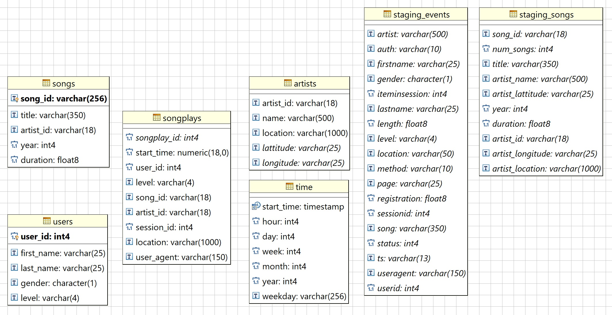

# DEND_P3

### SUMMARY ...

In this section we add description about the different files used:

* sql_queries.py: All SQL instruction to execute vs RedShift Database: DROPs, CREATEs, LOADs
* create_tables.py: Functions 2 create from scratch all RedShift tables
* etl.py: Main python program with all the logic to load RedShift tables

### DIAGRAM ...

We can observe how the database diagram has been implemented:



### DOCUMENT PROCESS ...

__ Discuss the purpose of this database in the context of the startup, Sparkify, and their analytical goals. __

__ State and justify your database schema design and ETL pipeline. __

### HOW TO ...

```
python create_tables.py
python etl.py
```
